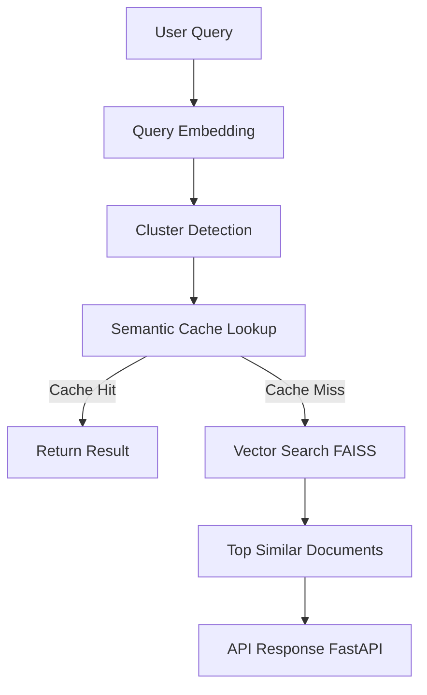

# Semantic News Search

A semantic search engine for news articles using sentence embeddings, vector similarity search, clustering, and caching.

## Features

- Semantic search using transformer embeddings
- Vector similarity search with FAISS
- Semantic query cache
- Cluster-aware retrieval
- Configurable similarity threshold
- Query latency tracking
- FastAPI API interface
- Docker container support

## Architecture



## Project Structure

```
semantic-news-search
│
├── app                # Main application code
│
├── scripts            # Data processing scripts
│   ├── build_embeddings.py
│   ├── run_clustering.py
│   └── analyze_clusters.py
│
├── Dockerfile         # Container setup
├── requirements.txt   # Python dependencies
└── .gitignore         # Ignored files
```

# Install dependencies:
pip install -r requirements.txt

# Run the API:
uvicorn app.main:app --reload

# Open API docs:
http://127.0.0.1:8000/docs

## API Interface
The project exposes a FastAPI REST API.


## Example Query
POST /query
{
"query": "space exploration"
}

# Response:
{
"query": "space exploration",
"cache_hit": false,
"latency_ms": 37,
"results": [
{
"text": "...",
"score": 0.82
}
]
}

## Example Query Result

## Technologies Used

- Python
- FastAPI
- Sentence Transformers
- FAISS
- NumPy
- Docker

## Future Improvements

- UI dashboard for search
- Distributed vector search
- Advanced ranking models
  
## Author
Sk Zaafira Yumn
